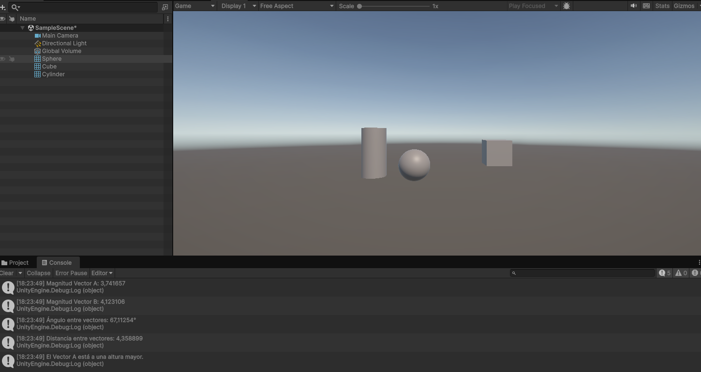
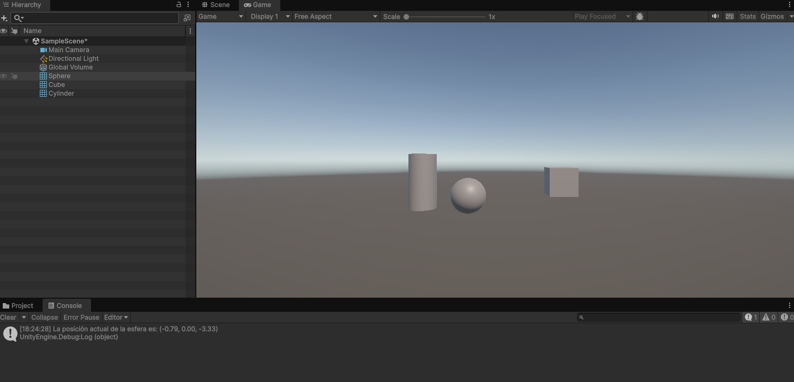
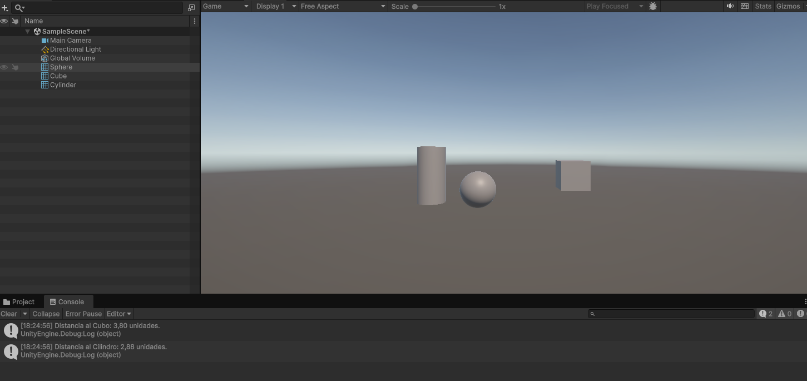

# Práctica 1: Introducción y Primeros Pasos
**Asignatura:** Interfaces Inteligentes  
**Universidad:** Universidad de La Laguna (ULL)  
**Autor:** Darío ([@Dario-ULL](https://github.com/Dario-ULL))

---

## Estructura del Repositorio
* **`Scripts/`**: Contiene el código fuente y scripts desarrollados para la práctica.
* **`Gif/`**: Contiene las capturas y animaciones que demuestran el funcionamiento de cada apartado.

---

## Demostraciones y Ejercicios

### Demostración General
Demostración en video/animación del funcionamiento global de la escena o proyecto:

  

---

### Ejercicio 2
Descripción breve de lo realizado en el Ejercicio 2.

  

---

### Ejercicio 3
Descripción breve de lo realizado en el Ejercicio 3.

  

---

### Ejercicio 4
Descripción breve de lo realizado en el Ejercicio 4.

  

